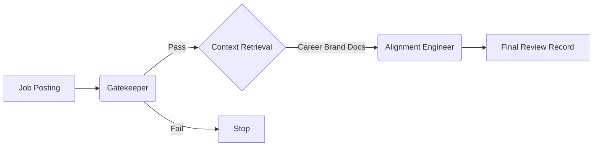

# AGENT.md — Fit Review Service

> [!IMPORTANT]
> This service uses **LangGraph** for orchestration and **Langfuse** for prompt management.
> All logic is "Flow-as-Code". Visual prototyping can be done in LangFlow but must be transpiled to Python.

## Core Agents

### 1. Gatekeeper Agent

**Role**: Efficiently filter job postings to save compute and time.

- **Input**: Raw Job Description text.
- **Context**: Minimal (Brand Voice only).
- **Goal**: Determine if the job is structurally relevant (e.g., Seniority, Tech Stack overlap).
- **Output**: JSON `{ "recommend": boolean, "rationale": string }`

### 2. Alignment Engineer

**Role**: Deep analysis of fit against the user's specific Career Brand.

- **Input**: Job Description + Gatekeeper Rationale.
- **Context**: **Full Career Brand** (North Star, Values, Trajectory, etc.) from ChromaDB.
- **Goal**: Provide a definitive "Go/No-Go" recommendation with confidence score.
- **Output**: JSON `{ "recommend": boolean, "confidence": "high"|"medium"|"low", "rationale": string, "alignment_score": float }`

## Workflow

## Prompt Engineering Guide (Langfuse)

- **Gatekeeper**: `jobs/gatekeeper-agent`
- **Alignment**: `jobs/alignment-engineer`

Prompts should be tuned in Langfuse. The code automatically fetches the latest production version.
